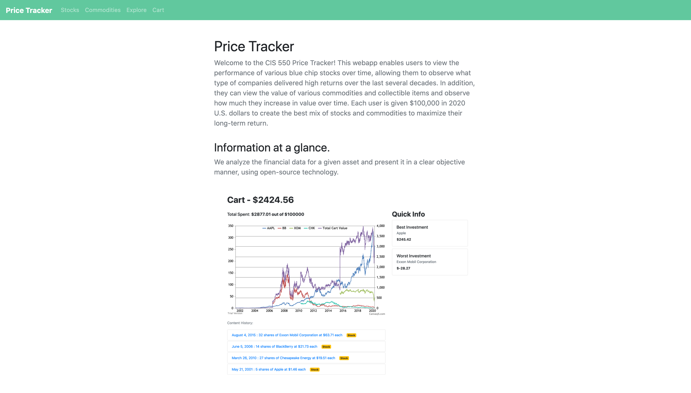
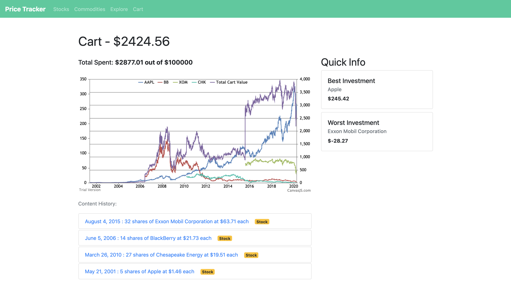
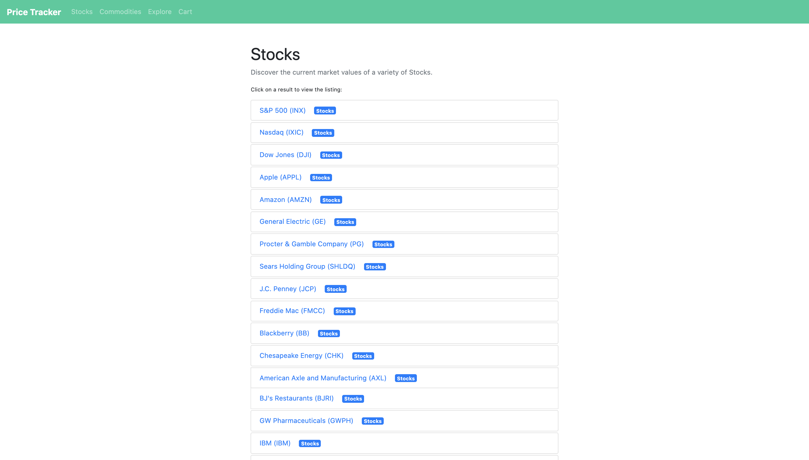
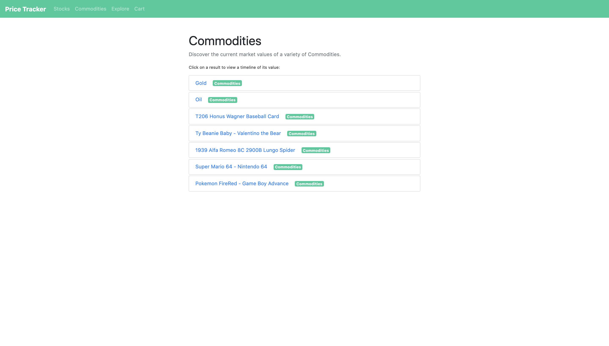
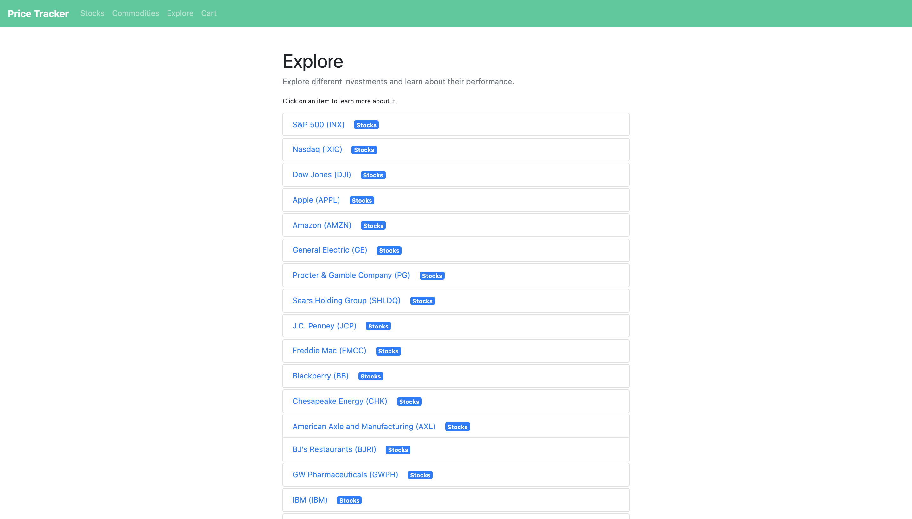
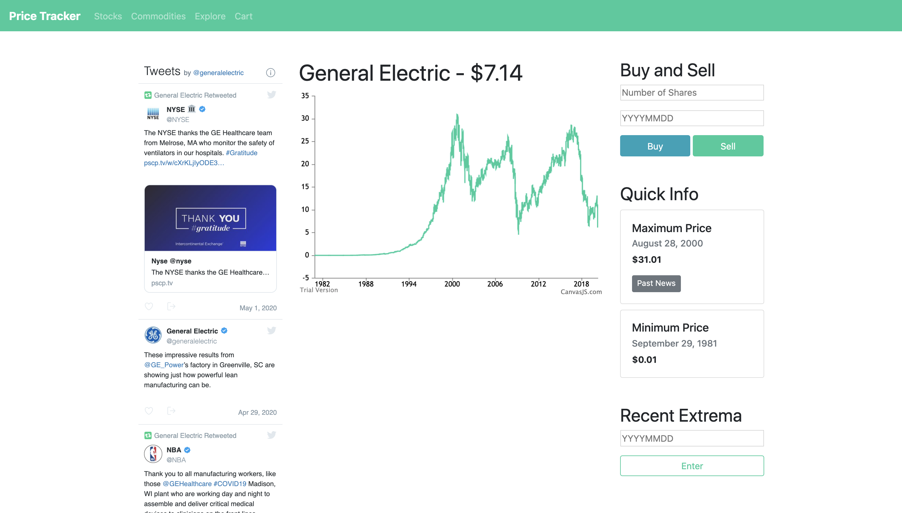
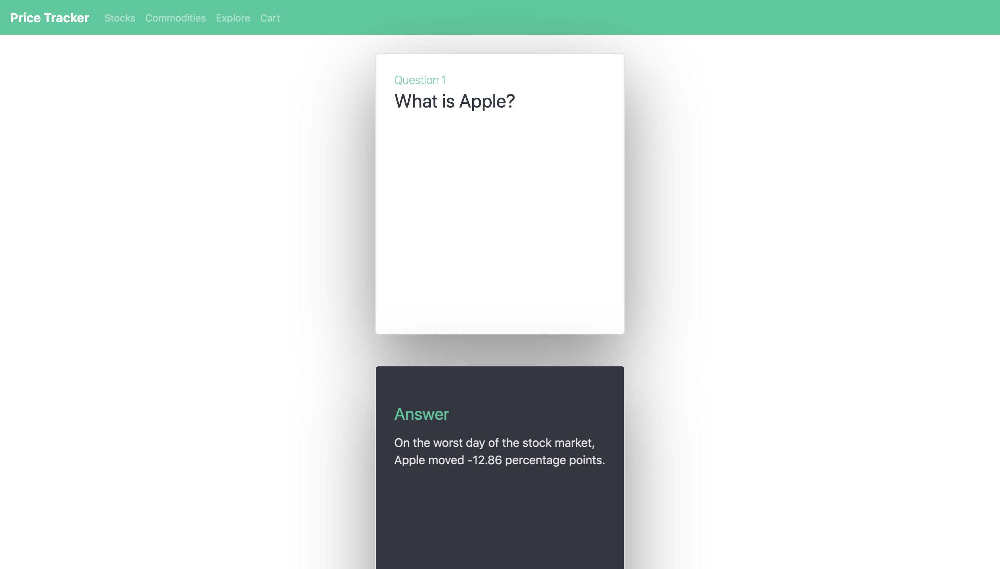

# Price Tracker
CIS 550 Final Project: A Fun Interactive Price Tracker

## Description
This webapp enables users to view the performance of various blue chip stocks over time, allowing them to observe what type of companies delivered high returns over the last several decades. In addition, they can view the value of various commodities and collectible items and observe how much they increase in value over time. Each user is given $100,000 in 2020 U.S. dollars to create the best mix of stocks and commodities to maximize their long-term return.

## Project Video
A video demonstrating our app can be viewed [here](https://youtu.be/TEp6yA41-_Q)
## Live Version
A live version of our app can be visited at: https://stormy-citadel-63553.herokuapp.com/

## Setting Up Local Environment
To set this application up locally, begin by downloading this repository. You must install Python 3.7.6 and the following Python Libraries: Flask and cx_Oracle. \
In addition, it is necessary for the user to install the local Oracle Instant Client. A tutorial to do this can be found [here](https://www.oracle.com/database/technologies/instant-client.html)

## Running Application
Once the local environment is set up, cd into the root of price_tracker and execute the following commands:
```
cd app
python3 server.py
```
The app will be running on http://0.0.0.0:8000/
## Data Sources
Stock/Index Data: www.finance.yahoo.com \
Gold Data: https://bit.ly/2SvPoey \
Oil Data: https://datahub.io/core/oil-prices \
Video Game Data: https://www.pricecharting.com/ \
On This Day Data: https://bit.ly/2xttxNi \
Beanie Babies Data: https://bit.ly/2KS9g7e \
Honus Wagner Data: https://bit.ly/35tfOms \
Alfa Romeo Data: https://bit.ly/2SsPGCz 

## Data Cleaning
The Data folder contains all raw data, cleaned data, and cleaning scripts. We used Python scripts and Microsoft Excel to clean and standardize our data

## Database
We use a single Oracle RDS on AWS to store all of our data

## SQL Queries
All 19 of our unique SQL queries can be found in [this file](https://github.com/ksjiaxian/price_tracker/blob/master/sql/sql_queries/sql_queries.sql). 

## Screenshots
Home Page \
 \
Cart Page \
 \
Stocks Page \
 \
Commodities Page \
 \
Explore Page \
 \
Item Page \
 \
Item Explore Page \
 

